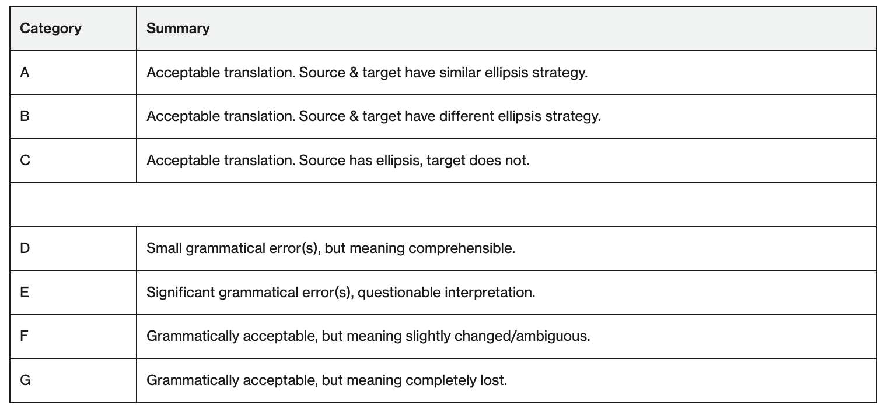

```{r setup, include = FALSE}
library("papaja")
library("tidyverse")
library("here")
library("ds4ling")
library("lmtest")
library("reshape2")
r_refs("r-references.bib")
#tinytex::install_tinytex()
```

```{r analysis-preferences}
# Seed for random number generation
set.seed(42)
knitr::opts_chunk$set(cache.extra = knitr::rand_seed)
```

# Methods
We report how we determined our sample size, all data exclusions (if any), all manipulations, and all measures in the study. <!-- 21-word solution (Simmons, Nelson & Simonsohn, 2012; retrieved from http://ssrn.com/abstract=2160588) -->

## Participants
A total of 14 participants were recruited for this study. Participant age ranged between 19 and 22 years old. All participants were L1 speakers of English, none of which had any formal linguistics training.

## Materials

### Source Sentences
15 sentences containing one of three ellipsis strategies present in Japanese were generated or selected from existing literature (five for each ellipsis strategy). The three selected strategies were argument ellipsis, verb-phrase-ellipsis-like constructions, and sluicing. Japanese sentences were generated with the help of two native Japanese speakers. An intended translation was provided for each sentence to serve as a comparison for the machine-generated translations.

### Stimuli - Translations
Each of the 15 Japanese sentences was translated using Google, Microsoft Bing, and DeepL Translate (all three services utilize artificial neural networks) for a total of 45 translations.

## Acceptability Rating Task

### Procedure
Participants were screened for English proficiency prior to completing this task. For the acceptability rating task, participants were presented with each of the 45 machine-generated translations along with an alphabetical scoring scale (A, D, E, F, G) and asked to assign a score to each translation. Additionally, there were two filler questions presented to the participants halfway and three-quarters of the way through the acceptability rating task.

### Scoring
The original alphabetical scoring scale was adopted from [Khullar 2021](https://direct.mit.edu/coli/article/47/4/927/106771/Are-Ellipses-Important-for-Machine-Translation):



For the present study, B and C scores are removed. This was done in part to account for participants’ lack of linguistic background. Additionally, argument ellipsis and VPE-like constructs do not exist in English. As such, any grammatical translation in English would not contain these ellipsis strategies, guaranteeing a B or C ranking for Japanese sentences that contain them. The research questions of this project revolve around the accuracy of translation services—that is, how faithfully translation services are able to retain meaning and grammaticality across across Japanese-English translations. As such, B and C scores were replaced with A scores.
Participant-provided alphabetical scores were converted into two sets of numerical scores to quantify the machine translation services’ performance on both the meaning and grammaticality of their outputs. The letter-to-number conversion is as follows:

```{r, num_scoring, echo=FALSE}
alphabetical_score <- c('A', 'D', 'E', 'F', 'G')
meaning_score <- c(5, 4, 3, 2, 1)
grammaticality_score <- c(5, 2, 1, 4, 3)
table <- data.frame(alphabetical_score,meaning_score,grammaticality_score)
table %>% knitr::kable()
```

The original alphabetical scoring scale only evaluates a translation’s faithfulness to the source sentence ellipsis strategy (A-C) and meaning (D-G). Adding another scoring scale for grammaticality allows us to evaluate grammaticality and meaning independently of one another.

# Results

## Summary of Data
14 participants produced 45 acceptability judgments each for a total of 1260 observations (630 for grammaticality and 630 for meaning). Responses to all questions were collected on a Google Form and converted into a .csv file. In the data tidying process, all non-evaluation data were removed. Participant-given alphabetical scores were converted into two separate numerical scores using the system outlined above to yield the following data:
```{r, data_tidy}
data_tidy <- read_csv('../data/data_tidy/589_tidy.csv')
head(data_tidy) %>%
  knitr::kable()
```
## Descriptive Statistics
Mean scores for meaning and grammaticality by ellipsis type and machine translatin service are listed below:
```{r, read_tidy, include=FALSE}
data_tidy = read_csv(file=here("data","data_tidy","589_tidy.csv"))
data_factor <- data_tidy %>%
  mutate(
    ellipsis_type = as.factor(`ellipsis_type`),
    num_metric = as.factor(`num_metric`)
  ) #%>%
  #select(ellipsis_type,num_metric,num_score)
data_factor
```

```{r desc_stats_el, echo=FALSE, message=FALSE}
ellipsis_stats <- data_factor %>%
  group_by(ellipsis_type,num_metric) %>%
  summarize(avg=mean(num_score)) %>%
  pivot_wider(names_from="num_metric", values_from="avg") %>%
  knitr::kable()

ellipsis_stats
```

```{r desc_stats_mt, echo=FALSE, message=FALSE}
mt_stats <- data_factor %>%
  group_by(mt_service,num_metric) %>%
  summarize(avg=mean(num_score)) %>%
  pivot_wider(names_from="num_metric", values_from="avg") %>%
  knitr::kable()

mt_stats
```

The descriptive statistics suggest that DeepL Translate produces more acceptable translations than Google Translate or Microsoft Bing. Additionally, VPE-like constructs have the lowest average meaning and grammaticality scores, suggesting that this ellipsis type is more difficult to translate than the other two types. The translation services also have higher average grammaticality scores than they do meaning scores, suggesting that services may prioritize the grammaticality over meaning.

## Data Analysis

The data were analyzed using a general linear model. Meaning score and grammaticality score were the criteria with ellipsis type and machine translation service as predictors. Main effects of ellipsis type and machine translation service and the ellipsis type by machine translation service interaction were assessed using nested model comparisons. Experiment-wise alpha was set at 0.05.

## Results - Meaning

There was a main effect of ellipsis type (F(1) = 16.2938, p < 0.001) but not machine translation service on meaning score. There was also main effect of an ellipsis type by machine translation service interaction (F(1) = 7.7691; p < 0.001). The model containing the interaction provided the best fit of the data (R2 = 0.085). Although this model is better than the other models tested, it only results in 8.5% of variance in proficiency score values being explained by the interaction between ellipsis type and machine translation service.


Translation scores of sentences originally utilizing VPE-like constructs are affected by the sentence's possession of this ellipsis type. Specifically, sentences with VPE-like constructs yielded translations scoring 0.7 +/-0.24 se points (t=-2.903, p < 0.004) lower compared to sentences containing argument ellipsis, which yield and average translation meaning score of 3.74 +/- 0.17 se (t = 21.95, p < 0.001).

## Results - Grammaticality

There was a main effect of ellipsis type (F(1) = 24.5058, p < 0.001) and machine translation service (F(1) = 5.0804, p < 0.007). There was also main effect of an ellipsis type by machine translation service interaction (F(1) = 4.1159; p < 0.003). The model containing the interaction provided the best fit of the data (R2 = 0.097). Although this model is better than the other models tested, it only results in 9.7% of variance in proficiency score values being explained by the interaction between ellipsis type and machine translation service.

Translation scores of sentences are affects by the source sentence's ellipsis type. Sentences with argument ellipsis have an average translation grammaticality score of 4.26 +/- 0.14 (t = 29.99, t < 0.001). Sentences with sluicing score 0.48 +/- 0.20 se (t = -2.4, p < 0.02) points lower than sentences with argument ellipsis, and sentences with VPE-like constructions score 1.07 +/- 0.20 se (t = -5.3, p < 0.001) lower.

\newpage

# References

::: {#refs custom-style="Bibliography"}
:::
